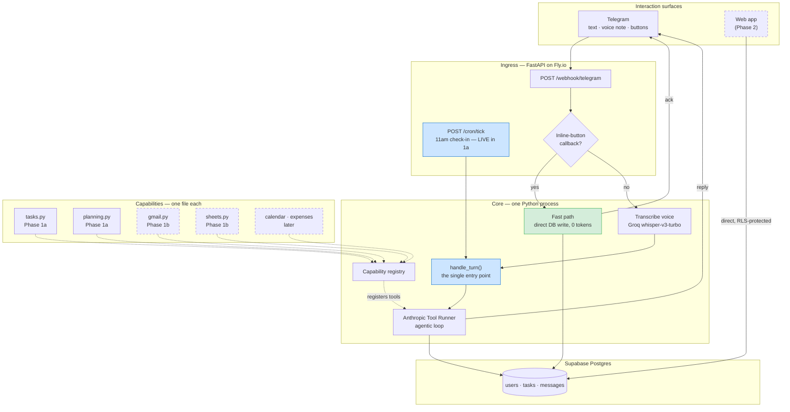
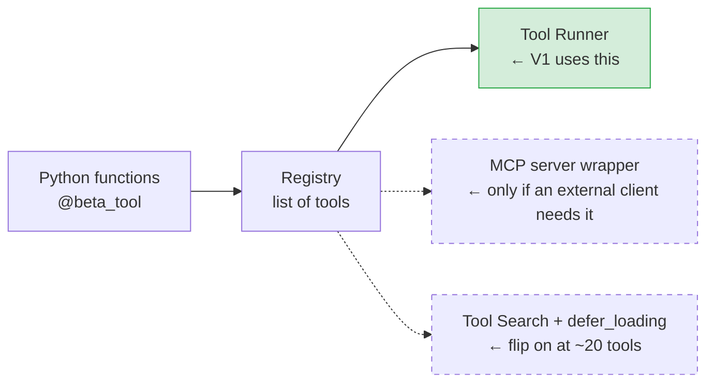
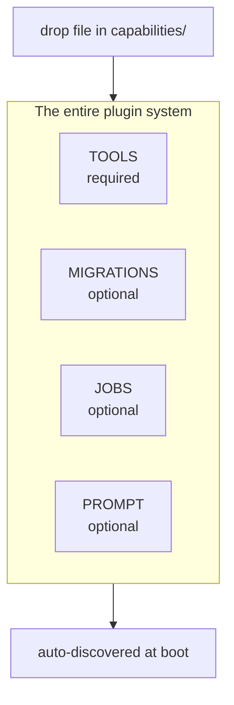
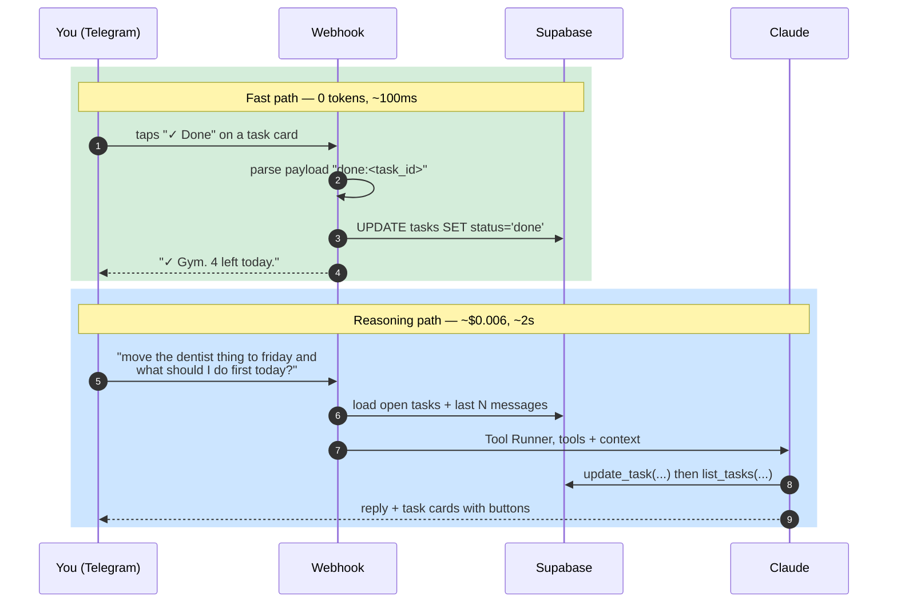
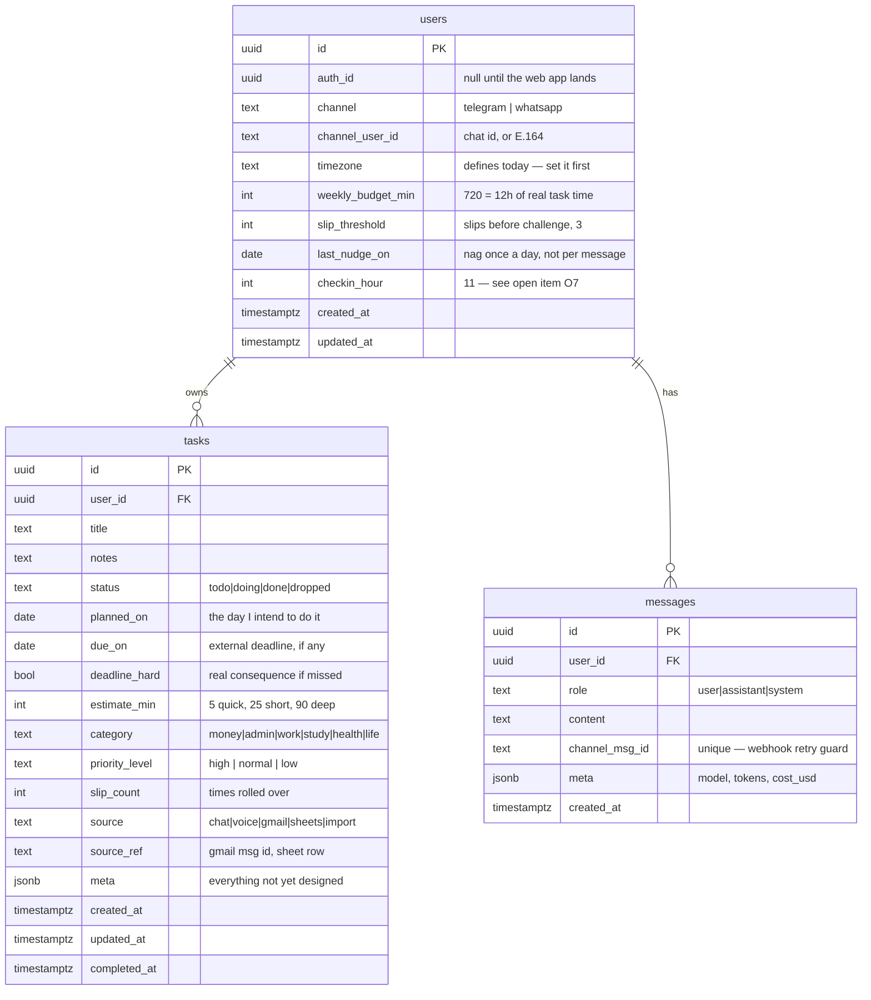
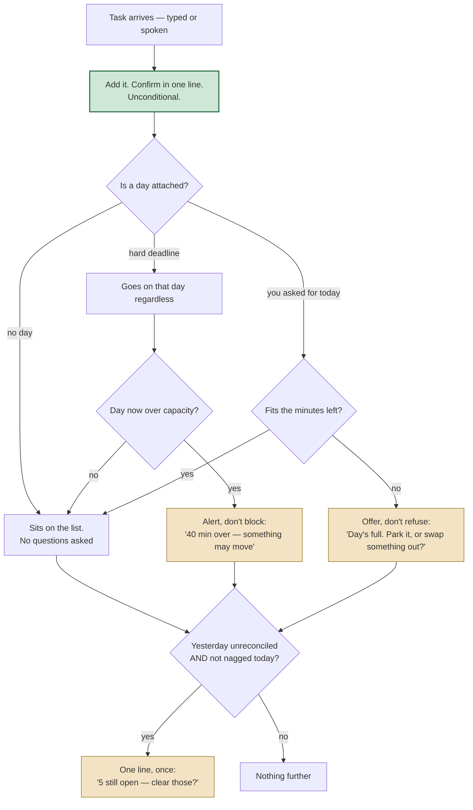
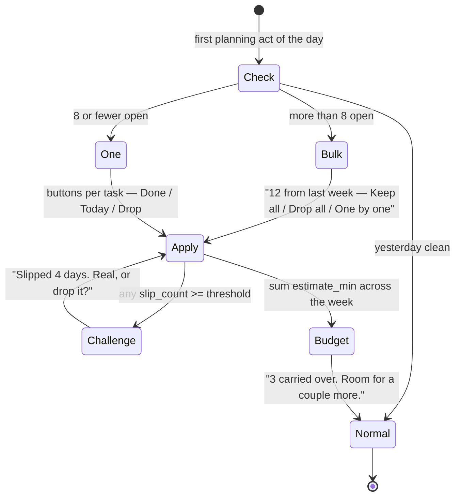

# Personal Assistant — Architecture V1

Status: **foundation locked.** D1–D11 settled. Build order and verification live in [PLAN-V1.md](PLAN-V1.md).
Date: 2026-09-12 · supersedes the 2026-09-11 draft
Scope: the frozen *why* behind V1. The plan cites section numbers rather than re-deriving decisions. Genuinely open items are in §6, and none of them block Step 0.

---

## 1. What V1 is

A single-user assistant reachable over **Telegram** (typed or voice note) that owns a to-do list and runs a **daily rollover ritual**: yesterday's list is reconciled before the day gets planned — what's done, what slipped, what's now the real top priority. If you haven't opened the day yourself by 11am, it opens it for you.

Two things changed after the first draft and are load-bearing everywhere below: **capture is never blocked** (D8), and **the channel is Telegram rather than WhatsApp** because the 11am check-in forced it (D6).

### Success criteria (from the interview, verbatim intent)

| # | Criterion | Phase |
|---|-----------|-------|
| S1 | I can add/update/complete tasks conversationally, by text or voice | 1a |
| S2 | Yesterday's list is reconciled before new tasks are accepted | 1a |
| S3 | It is *realistic* — it speaks up when the week is genuinely full, measured in **time rather than task count**, or when a task keeps slipping | 1a |
| S4 | I can mark a task done without paying for an LLM round trip | 1a |
| S5 | Deadlines (assessments, bills, credit cards) are extracted from Gmail and become tasks | 1b |
| S6 | **Capturing a task is never blocked and never lectured.** Friction lives at planning time, not capture time | 1a |
| S7 | If I haven't opened the day myself by 11am, it opens it for me | 1a |

**S5 is split out deliberately.** It is the highest-value feature and the one most likely to eat a month if it's tangled with the core. It is Phase 1b: a capability module that drops into the seam 1a builds. Nothing in 1a is thrown away to add it.

**Non-goals for V1:** multi-user UI, calendar, expenses, web app. Each has a named seam below; none is built.

*Proactive messaging was a non-goal in the first draft.* The 11am check-in (S7) moved it into V1, and that single change is what settled the channel — see D6.

---

## 2. System diagram



The two blue boxes are the same thing reached two ways: **`handle_turn()`** is the only path a conversation ever takes, and `/cron/tick` is simply a second caller of it (D6). The **green fast path** is how most interactions avoid the model entirely (D4).

---

## 3. Decisions

### D1 — Voice is a message type, not a channel

You asked for two interaction points. They collapse into one.

A voice note arrives on the same webhook as text — it is a message *type*, not a second channel. Download the `.ogg`, send it to Groq `whisper-large-v3-turbo` at **$0.04/hour of audio** (≈$0.0007/minute), and the rest of the pipeline is identical. At five voice notes a day that is under $0.05/month.

> **One front door, not two.** No separate voice stack, no wake word, no telephony. Deleted before it was built.

**Corrected from the first draft:** that draft leaned on WhatsApp shipping its own transcript in the webhook payload, making transcription usually free. **That does not apply on Telegram** — budget for transcribing every voice note. The cost is negligible either way, but the claim was channel-specific and the channel changed (D6).

A real standalone voice interface — always listening, speaking back — is a different product with different latency requirements. Add it when voice notes prove insufficient, not before.

### D2 — Tool protocol: plain Python functions via the SDK Tool Runner. Not MCP.

You asked for research. Here it is.

**What MCP actually is:** a transport and discovery protocol for exposing tools *across a process or vendor boundary*. Its value proposition is that a tool server written once can be consumed by Claude Desktop, Cursor, your app, and someone else's app.

You have no such boundary. One process, one consumer, all code yours. Measured against your three criteria:

| Criterion | MCP | Native tools (SDK Tool Runner) | Verdict |
|-----------|-----|-------------------------------|---------|
| **Latency** | Extra client→server round trip per call. ~sub-10ms local stdio; 20–200ms if the server is remote. Gateways exist that cut overhead to ~11µs, but that's a *gateway you now operate* | In-process function call, ~0ms | Native. Not decisive at your scale, but it's free |
| **Accuracy** | Not a property of the protocol. Accuracy degrades with *tool count in context*, identically either way | Same | **Tie — the question was mis-framed** |
| **Cost** | Tool schemas are tokens in every request. Same either way. MCP adds an operational cost: a second process to run, supervise, and deploy | No second process | Native |
| **Portability** | Real, and MCP's actual win | Locked to your app | MCP — but you don't need it yet |

**The accuracy finding is the important one.** Accuracy is driven by how many tool definitions sit in the context window, not by which protocol delivered them. Anthropic's own numbers on large tool libraries: with a **Tool Search Tool** and `defer_loading: true`, Opus 4 went 49% → 74% and Opus 4.5 went 79.5% → 88.1%, with ~85% fewer tokens spent on tool definitions (~77K → ~8.7K in the reference case). That mechanism is a **first-class Messages API feature that works on native tools** — it is not an MCP feature. So the thing that would actually fix accuracy at 50 tools is available to you *without* MCP.

**Decision:**

- **Now:** capabilities are Python functions decorated with `@beta_tool`, driven by `client.beta.messages.tool_runner(...)`. The SDK already owns the agent loop, the schema generation from type hints, and per-turn hooks for approval/logging. Writing a custom registry + loop would be re-implementing a dependency you already have.
- **At ~20+ tools:** turn on `tool_search_tool_bm25_20251119` and mark low-frequency tools `defer_loading: true`. A config change, not a rewrite. *(At least one tool must stay non-deferred or the API 400s.)*
- **If you ever want Claude Desktop / another client to drive your assistant:** wrap the same registry in ~40 lines of MCP server. The functions don't change. MCP becomes an *export format*, which is what it's good at.



> Skipped: MCP, LangChain/LangGraph, any agent framework. Add MCP when a client you don't own needs these tools; add a framework never — the loop is one SDK call.

### D3 — The modularity contract

This is the part you care most about, so it is deliberately small. **A capability is one file.**

```python
# capabilities/tasks.py

from anthropic import beta_tool

@beta_tool
def add_task(title: str, planned_on: str | None = None, due_on: str | None = None,
             deadline_hard: bool = False, estimate_min: int = 25,
             priority_level: str = "normal", category: str | None = None,
             notes: str | None = None) -> dict:
    """Add a task. planned_on = the day you intend to do it; due_on = the
    world's deadline. estimate_min: quick 5, short 25, deep 90."""
    ...

@beta_tool
def complete_task(task_id: str) -> dict:
    """Mark a task complete."""
    ...

TOOLS = [add_task, complete_task, ...]   # required
MIGRATIONS = "migrations/001_init.sql"   # optional — own your tables
JOBS = []                                # optional — scheduler seam
PROMPT = "..."                           # optional — appended to system prompt
```

Core does this, and nothing more:

```python
for mod in pkgutil.iter_modules(capabilities.__path__):
    m = importlib.import_module(f"capabilities.{mod.name}")
    TOOLS.extend(m.TOOLS)
```

Adding Gmail = adding `capabilities/gmail.py`. Core is not touched. No plugin manifest, no registry class, no lifecycle hooks, no DI container.



> Skipped: plugin manifests, versioning, a capability lifecycle, hot reload. Add when a capability is written by someone who isn't you.

### D4 — Two paths, and the cheap one is the default

Every interaction takes one of two paths. Choosing correctly is the single biggest cost lever in the system.



This is the answer to your question about checking a task off without another pipeline run. The fix isn't a web app — it's **inline-keyboard buttons whose callback payload carries the task id**. Deterministic parse, direct write, no model. A web app is still worth building later for bulk triage, but it is no longer *required* for what you asked for.

Roughly 40% of turns should land here. That share is the main reason the monthly bill stays near $13 rather than $30.

### D5 — Schema: three tables and a JSONB escape hatch

You said the schema will evolve. So the schema is designed to be wrong.



Four notes, each load-bearing:

0. **`planned_on` vs `due_on` are different things** and conflating them was a bug in the first draft. The bill is *due* Friday; you might *plan* it for Wednesday. Rollover operates on `planned_on`; urgency comes from `due_on`. A task with a `due_on` and no `planned_on` is a deadline you haven't scheduled yet — exactly the thing that gets forgotten.
1. **`meta jsonb` on `tasks`** is the evolution answer. New field idea? It lives in `meta` until it's used enough to earn a column. No migration to experiment.
2. **`slip_count`** is how S3 ("be realistic") gets teeth. A task rolled over four times gets challenged — *"this has moved 4 days. Is it actually happening, or should it drop?"* — rather than silently re-added. This is the difference between a to-do app and an assistant.
3. **`user_id` + Row Level Security from day one.** You are one user now and many later. A `user_id` column and an RLS policy cost one hour today and a painful migration later. This is **not** an accounts system, a login screen, or roles — just the column and the policy.
4. **`source` + `source_ref`** is the ingestion seam. Gmail-created tasks are ordinary tasks with `source='gmail'` and the message id. No separate table, no sync engine.

**Migrations are plain `.sql` files** applied in order. No ORM, no Alembic — you have three tables. The live draft is [migrations/001_init.sql](migrations/001_init.sql); expect to rename columns in week one, which is what `meta` is for.

Two columns do work that would otherwise be application code:

- **`messages.channel_msg_id`** carries a partial unique index. Telegram and WhatsApp both retry webhooks, so "never process the same message twice" becomes a database guarantee instead of code that has to remember to be careful.
- **`tasks_open_planned_idx`**, a partial index on open tasks by `planned_on`, is the rollover query. It runs every morning and is the one that has to stay fast as the table grows.

> Skipped: subtasks, projects, recurrence, dependencies. Each is a column or a `meta` key when you miss it in real use.
>
> *Time estimates were on this list and came off it* — D9 is why. That is the list working as intended: a skip earns its way back in when real use exposes the limit, not when it sounds useful.

**Import (your Q4): skipped entirely.** You have nothing to import. When you do, it's one tool function that takes pasted text.

### D6 — Telegram, not WhatsApp. And proactive is in V1.

Two decisions that turned out to be one decision.

**The 11am check-in settled the channel.** You added a fallback: if you haven't messaged by 11am, it opens the day itself. That message fires *precisely when you haven't been in the chat* — which on WhatsApp is outside the 24-hour service window, where free-form text is not permitted at all. It would have to be a **pre-approved template**, and a template cannot carry a briefing composed that morning from your actual list.

So the feature you wanted is not expressible on WhatsApp without degrading it. Against that:

| | WhatsApp Cloud API | Telegram Bot API |
|---|---|---|
| Messaging you unprompted | Pre-approved template only, fixed shape | Free-form, any time |
| 24-hour service window | Yes — and free-form replies inside it stop being free on **1 Oct 2026**, then 1,000 free service messages/month | None |
| Setup | Meta Business verification + dedicated number, several days | BotFather, about two minutes |
| Per-message cost | Yes, post-October | None |
| Buttons, voice notes | Yes | Yes |

**Decision: Telegram for V1.** Not as a stopgap — as the channel that supports the product. The adapter is roughly 20 lines behind one interface, so WhatsApp remains a one-day swap if you later decide the template constraint is acceptable.

**Hosting follows:** a webhook must be publicly reachable and always up, so your Mac is out. **Fly.io, ~$5/month**, deployed on day one rather than at the end.

**The proactivity seam is that there isn't one.** Proactive is the same function with a different caller:

```python
# webhook   → handle_turn(user_id, text)
# cron tick → handle_turn(user_id, "<system> morning check-in")
```

`/cron/tick` walks users, converts to local time, and for anyone at 11:00 who has sent nothing today calls `handle_turn`. If a second code path ever appears here, the seam is gone — which is why it's an explicit check in the plan.

> Skipped: a job queue, Celery, APScheduler. One cron hitting one endpoint, and the endpoint already exists.

### D7 — Models and cost

Python. Anthropic SDK. Two models, routed by *which path*, not by intent classification:

| Route | Model | Why | Est. volume | Est. $/mo |
|-------|-------|-----|-------------|-----------|
| Fast path (button taps) | **none** | deterministic parse | ~40% of turns | $0.00 |
| Conversational CRUD | `claude-haiku-4-5` | short, structured, high frequency | ~500 turns | ~$3 |
| Daily rollover + prioritisation | `claude-opus-5` | real reasoning, judgement about your day | 1–2/day | ~$3 |
| Gmail extraction (1b) | `claude-opus-5` | precision matters — a missed bill is the failure case | batched, 1/day | ~$2 |
| Voice transcription | Groq `whisper-large-v3-turbo` | $0.04/hr, every note (D1 correction) | — | <$0.10 |
| 11am check-in | `claude-opus-5` | one composed briefing a day | 30/mo | ~$1 |
| Telegram | — | no per-message cost, unlike WhatsApp | — | $0.00 |
| Hosting | Fly.io | always-on webhook | — | ~$5 |
| Supabase | free tier | 500MB DB, plenty | — | $0 |
| | | | **Total** | **≈$13/mo** |

**Prompt caching** on the system prompt + tool definitions is a further ~10x reduction on cached input and should be on from day one. Verify it works by checking `usage.cache_read_input_tokens` is non-zero — if it's zero, something volatile (a timestamp, an unsorted dict) is in the cached prefix.

Note on Supabase free tier: projects **pause after 7 days of inactivity**. Daily use makes this a non-issue; a daily cron makes it impossible.

> The escape hatch if quality disappoints: promote the CRUD route from Haiku to Opus 5 at `effort: "low"`. That's a one-line change and still lands near $20.

### D8 — Capture is never blocked. The gate moved.

Your original rule stands: yesterday gets reconciled before today gets planned. But the first draft enforced it at the wrong moment.

**Blocking at capture is the worst possible place for friction.** A blocked capture means the thought is lost — and losing thoughts is the entire reason this product exists. Two different acts, two different rules:

| Act | Example | Rule |
|-----|---------|------|
| **Capture** — onto the list, no day attached | *"add: renew insurance"* | **Never blocked, never lectured.** One-line confirmation, always |
| **Commit** — onto *today* | *"what should I do today?"*, *"I'll do the assessment today"* | Reconciliation and capacity apply here |

Reconciliation is prompted *after* the confirmation, never instead of it:

```
you  →  add: renew insurance
it   →  Added.
it   →  5 from yesterday are still open — clear those?   ← at most once today
```

**The once-a-day rule is the anti-frustration mechanism**, and it costs one column (`users.last_nudge_on`). Nagging per message is what makes an assistant exhausting; nagging once is what makes it useful.

Three consequences worth stating, because they are the edge cases you were reaching for:

- **Brain dump** — seven tasks in one message get one confirmation and zero nags. Not seven of each.
- **Back after three days** — 20 unreconciled tasks are never presented one at a time. Over ~8, it switches to bulk triage: the list, with *Keep all / Drop all / Go one by one*.
- **11pm capture** — adding at night doesn't trigger a morning ritual. Reconciliation is bound to the first *planning* act of a day, not to any message.

> Skipped: a snooze command, per-category nag settings, quiet hours. The once-a-day cap makes them unnecessary; add if it still nags too much.

### D9 — Capacity is minutes, not tasks. Categories group, they don't gate.

You proposed categories that bypass the gate. The axis is wrong, and your own examples show it: **pay card bill** (2 min) and **call the bank** (15+ min) are both "finance" — same category, opposite treatment. Topic predicts neither cost nor urgency, so it cannot be what decides pushback.

Two axes drive behaviour:

| Axis | Values | Controls |
|------|--------|----------|
| **Effort** | `quick` ≤5min · `short` ~25min · `deep` ~90min | Whether it consumes the day |
| **Deadline** | `hard` (real consequence) vs `soft` (self-imposed) | Whether it is negotiable at all |

Stored as `estimate_min` (an integer, so the bucket is display only and a correction like "that's a 40 minute job" just works) and `deadline_hard`.

**Counting capacity in minutes dissolves your quick-task problem without a bypass rule.** Eight 3-minute payments is 24 minutes — nothing fires, because nothing is actually full. One mechanism, and the special case never gets written.

The resulting behaviour, which is what you asked for:

| Situation | What it does |
|-----------|--------------|
| Any capture, no day | Adds. Confirms. Silent. |
| Quick task onto today | Adds. Confirms. Silent — 5 minutes isn't a decision |
| **Hard deadline onto a full week** | **Adds anyway, then alerts**: *"On today — that makes it a heavy week. The side project is the only soft thing on there."* Never refused |
| Soft task onto a full week | Adds to the list, *offers* today: *"Week's pretty full. Park it, or swap something out?"* |

**Three independent fields, no overlap.** This is why "high priority" is not a category:

| Field | Set by | Drives |
|-------|--------|--------|
| `priority_level` | you, explicitly — the model may propose | *Order.* What gets done first when the day is short |
| `category` | the model, descriptively | *Grouping.* The morning brief, and Gmail tagging what it creates |
| `estimate_min` + `deadline_hard` | the model, correctable in passing | *Capacity.* Whether the day is full, and whether it's negotiable |

A card payment is `money`, `high`, `quick` and `hard` all at once — four labels on four axes, none of them fighting. Collapsing any two of these into one column forces a choice between two true answers.

**Categories are descriptive, and earn their column elsewhere:** the morning brief groups by them (*"3 money things, 2 study"*), and Gmail tags what it creates. Free text, not an enum, so a new one needs no migration:

`money` · `admin` · `work` · `study` · `health` · `life`

**The budget is weekly, and it never speaks.** Two refinements you made after the first draft:

- **Weekly, not daily — 12 hours (`weekly_budget_min = 720`), resetting Monday 00:00 local.** Real weeks aren't uniform; a daily cap false-alarms on a packed Tuesday and wastes a free Saturday. Committed tasks count (done ones included — time spent is spent); captured-but-unscheduled tasks never do, or capture would inflate the week and contradict D8. Nothing rolls over: it's a budget, not a bank.
- **The arithmetic stays backend-side.** `day_status()` returns `week_is_full` as a boolean. The assistant may say *"that's a heavy week"*; it may never say *"you have 4h 20m left."* Minutes are how it decides when to speak, not something to report.

**One honesty note.** Time estimates are unreliable — yours and the model's. Capacity is a *soft* signal that informs, never a hard rule that refuses. After two weeks, `estimate_min` against actual completions gives a personal correction factor worth tuning. If estimates prove too noisy to trust at all, the fallback is to drop the arithmetic and surface the raw count instead — a Step 4 decision, not a schema one.

> Skipped: sub-hour precision, energy levels, time-of-day scheduling, calendar-aware capacity, per-day budget overrides. Calendar awareness is the real upgrade and arrives with the calendar module; until then `weekly_budget_min` is one number you set.

### D10 — A2A is not a tooling protocol. No.

You asked whether the Agent2Agent protocol was a good fit for tooling. It's a category error worth recording so it isn't revisited: **MCP connects an agent to tools; A2A connects an agent to other agents.** A2A is a delegation protocol for independent agents, typically owned by different teams or companies.

Adopting it here would mean splitting capabilities into separate networked agent *services*, each running its own LLM loop with its own system prompt and context window.

| | Effect here |
|---|---|
| **Cost** | Measured protocol overhead is ~7% more tokens at 5 rounds, **23% at 10 rounds with 39% pure overhead** — stateless re-invocation re-sends context each round. Worse, delegating means a second model call for work one call does today: the ~$3/month CRUD route becomes $10–12 for identical behaviour |
| **Reliability** | Network hops, partial failures, distributed state, version skew between agents — none of which a single process can have |
| **When it pays** | The literature is explicit: *when you have multiple specialist agents owned by different teams.* You have one person and one codebase |

**Multi-agent as a pattern is not A2A as a protocol**, and the pattern does have a place here. Gmail extraction deserves its own context window, its own tight prompt and its own model — and it gets all of that from a function that makes its own Claude call. Fifteen lines, no protocol, no network.

**Revisit when:** you want the assistant to talk to an agent *you don't own* — a bank's, a booking service's, someone else's assistant negotiating a time. That's A2A's real use case, and the D3 contract makes adopting it then a new file rather than a rewrite.

> Skipped: A2A, agent frameworks, orchestrator/worker splits over HTTP.

### D11 — The channel is swappable, and the constraints are adopted now

Telegram for V1 (D6), with WhatsApp a one-day swap rather than a rewrite. The interface is the easy half; what actually causes rework is building on Telegram capabilities WhatsApp lacks, so those limits are adopted from the start.

**The contract — four methods, one file.**

```python
# core/channels/base.py

@dataclass
class Inbound:
    channel: str            # "telegram" | "whatsapp"
    channel_user_id: str    # chat id, or E.164
    channel_msg_id: str     # idempotency key -> messages.channel_msg_id
    text: str | None
    voice_ref: str | None      # opaque handle; only the adapter knows how to fetch
    button_payload: str | None # set => fast path, D4

@dataclass
class Button:
    label: str    # <= 20 chars
    payload: str  # <= 64 bytes

class Channel(Protocol):
    name: str
    def verify(self, headers: dict, body: bytes) -> bool: ...
    def parse(self, body: dict) -> Inbound | None: ...
    async def fetch_voice(self, voice_ref: str) -> bytes: ...
    async def send(self, to: str, text: str, buttons: list[Button] | None = None) -> None: ...
```

**Three constraints adopted now, because they cannot be retrofitted.**

| Rule | Why | Cost of ignoring it |
|------|-----|---------------------|
| **Max 3 buttons, ≤20-char labels, ≤64-byte payloads** | WhatsApp reply buttons cap at 3 with short titles; Telegram has no such limit and will happily let you build six | A task card redesign, and rethinking every triage flow |
| **Plain text replies — no Markdown, no HTML** | The two platforms format differently and neither degrades gracefully | Every reply reads as literal asterisks after the swap |
| **Never edit a sent message** | Telegram can update a card in place; WhatsApp cannot | The check-off interaction has to be redesigned, not ported |

Editing is genuinely nicer on Telegram, and it is declined anyway. A short new confirmation line reads almost as well and ports without thought.

**Two structural rules keep the seam honest.**

- `handle_turn()` and every capability return a reply *object*; `app.py` sends it. Nothing outside `core/channels/` may import a channel module.
- **Verify:** `grep -rn "telegram" core/turn.py capabilities/` returns nothing. If it ever returns a line, the seam is already broken.

**What the swap actually costs afterwards:** roughly a day for `core/channels/whatsapp.py` plus Meta Business verification — and one thing no interface can absorb. **Unprompted messages on WhatsApp require a pre-approved template**, so the 11am check-in (S7) would become a fixed-shape template with variable slots rather than a briefing composed that morning. That is the price of the swap, and it is a product decision, not an engineering one.

> Skipped: a channel registry, per-channel capability negotiation, a plugin system for channels. Two implementations behind one Protocol, chosen by a config value.

---

## 4. What happens to a new task

S2, S3 and S6 all live here, so the flow is specified rather than left to the prompt.



Nothing on that chart refuses a task. Every amber box informs or offers.

### The reconciliation itself



Three rules make it an assistant rather than a list:

- **Capture is never gated.** Reconciliation is triggered by the first *planning* act of a day — asking what to do, or putting something on today — not by any message. Adding at 11pm doesn't start a morning ritual.
- **Capacity is finite, measured in time, and never quoted.** If carried-over work already fills `weekly_budget_min`, it says the week is heavy — qualitatively. "Realistic" means it may tell you the week is full; it still adds the task, and it never reads you the arithmetic (D9).
- **It nags once a day.** Tracked on `users.last_nudge_on`. One reminder is useful; one per message is why people abandon these things.
- **A question it asks expires.** If it asks for a missing deadline and you don't answer within **5 minutes**, it drops the question and leaves the task undated rather than chasing you. Held as `meta.pending_question = {field, asked_at}` on the task.
- **It opens the day if you don't.** No message from you by 11am local and the check-in fires: what's still open from recent days, what's set for today, and a question about the plan. It does not fire on a day you've already started (D6, S7).

## 5. Repo layout

```
personal-assistant/
├── app.py                   # FastAPI: /webhook/telegram, /cron/tick, /health
├── core/
│   ├── turn.py              # handle_turn() — the single entry point
│   ├── registry.py          # ~15 lines of capability auto-discovery
│   ├── db.py                # supabase client + 5 queries
│   └── channels/telegram.py # send/receive/buttons + voice download
├── capabilities/
│   ├── tasks.py             # 1a — 6 tools
│   └── planning.py          # 1a — rollover, budget, nag
├── migrations/
│   └── 001_init.sql
└── test_flow.py             # asserts, written per-step not at the end
```

Roughly 10 files. If it grows past 20 before Gmail ships, something went wrong.

`core/turn.py` does five things — load user, load context, run the Tool Runner, persist both messages, return the reply. The plan checks it stays under 80 lines; if it grows, logic has leaked out of the capabilities and the D3 seam is quietly dead.

---

## 6. Decided, and still open

### Settled — do not re-litigate

| # | Question | Decision |
|---|----------|----------|
| O1 | WhatsApp or Telegram for V1? | **Telegram.** The 11am check-in cannot be expressed as a WhatsApp template (D6) |
| O2 | Tasks first, or straight to Gmail? | **Tasks first.** Gmail has nowhere to write until the task store exists |
| O3 | Haiku/Opus split, or Opus everywhere? | **Split as specced** (D7). Revisit after a week of real use |
| O5 | How much task time is a full week? | **12 hours — `weekly_budget_min = 720`**, Monday reset, never spoken aloud (D9) |
| O6 | How many slips before a challenge? | **3** — `slip_threshold` |
| O8 | Is A2A worth adopting for tooling? | **No** (D10) |
| O9 | Does it message you unprompted? | **Yes — 11am, once, only if you haven't started the day** (D6, S7) |

### Genuinely open — none blocks Step 0

| # | Question | Default in use | Decide when |
|---|----------|---------------|-------------|
| O4 | Web app in Phase 2 — read-only or full edit? | Read + check-off; chat is the write surface | Bulk triage in chat gets tedious |
| O7 | `users.checkin_hour` is config for a value that never changes. Keep or hardcode 11? | Column exists | Whenever — a two-line migration either way |
| O10 | Where exactly does your "real deadline" line sit? | The model judges; you correct it in passing | The first time it misjudges — that's the example you need |
| O11 | Anything it must never do without asking first? | Nothing destructive except `drop_task`, which always confirms | When something concrete comes to mind |
| O12 | Per-day budget override ("today is only 2 hours") | Not built — needs a `users.meta` column | When you actually want to override a day |

---

## 7. Explicitly deferred

| Thing | Add when |
|-------|----------|
| MCP server wrapper | An external client (Claude Desktop, another app) needs these tools |
| Tool Search + `defer_loading` | Tool count passes ~20 |
| ~~Proactive nudges~~ | **Shipped in 1a** — the 11am check-in (D6). Further nudges: when you can name the one you want |
| Web app | Chat-based triage proves too slow for bulk updates |
| A2A / agent frameworks | An agent you don't own needs to talk to yours (D10) |
| Calendar, expenses | After Gmail — each is one file against the D3 contract |
| Job-application spreadsheet (`sheets.py`) | Phase 1b, alongside Gmail — status column updates from application emails |
| Multi-user auth | A second human asks to use it. The `user_id` column is already there |
| Subtasks, recurrence, projects | You hit the limit in real use |
| Calendar-aware capacity | The calendar module lands — until then `weekly_budget_min` is one number you set |

---

## Companion documents

- [PLAN-V1.md](PLAN-V1.md) — build order, seven steps, each with a check that can fail
- [migrations/001_init.sql](migrations/001_init.sql) — the live schema draft
- [.claude/skills/karpathy-guidelines](.claude/skills/karpathy-guidelines/SKILL.md) — installed; governs the code as well as the plan

---

## Sources

- [Anthropic — Introducing advanced tool use](https://www.anthropic.com/engineering/advanced-tool-use) — Tool Search Tool, `defer_loading`, accuracy figures
- [Scaling MCP Tools with Anthropic's Defer Loading](https://unified.to/blog/scaling_mcp_tools_with_anthropic_defer_loading)
- [MCP vs Function Calling (2026)](https://www.kunalganglani.com/blog/mcp-vs-function-calling) — round-trip latency comparison
- [Top MCP Gateways for Low-Latency Agents](https://www.getmaxim.ai/articles/top-mcp-gateways-for-low-latency-high-throughput-ai-agents/) — gateway overhead figures
- [WhatsApp API Pricing 2026: Free 24-Hour Window Ends in October](https://blog.peppercloud.com/whatsapp-api-pricing-everything-you-need-to-know/)
- [WhatsApp Service Message Pricing Changes, Oct 2026](https://sendpulse.com/blog/whatsapp-service-message-pricing) — 1,000 free service messages/month
- [Meta — Audio messages](https://developers.facebook.com/documentation/business-messaging/whatsapp/messages/audio-messages) — webhook-supplied transcripts
- [Whisper API pricing comparison](https://tokenmix.ai/blog/whisper-api-pricing) — Groq $0.04/hr
- [Supabase free tier limits 2026](https://automationatlas.io/answers/supabase-free-tier-limits-2026/) — 500MB, 7-day inactivity pause
- [MCP vs A2A protocols](https://onereach.ai/blog/guide-choosing-mcp-vs-a2a-protocols/) and [A2A vs MCP vs REST](https://www.lyzr.ai/blog/a2a-vs-mcp-vs-rest) — D10
- [LDP: an identity-aware protocol for multi-agent LLM systems](https://arxiv.org/pdf/2603.08852) — A2A token-overhead measurements
